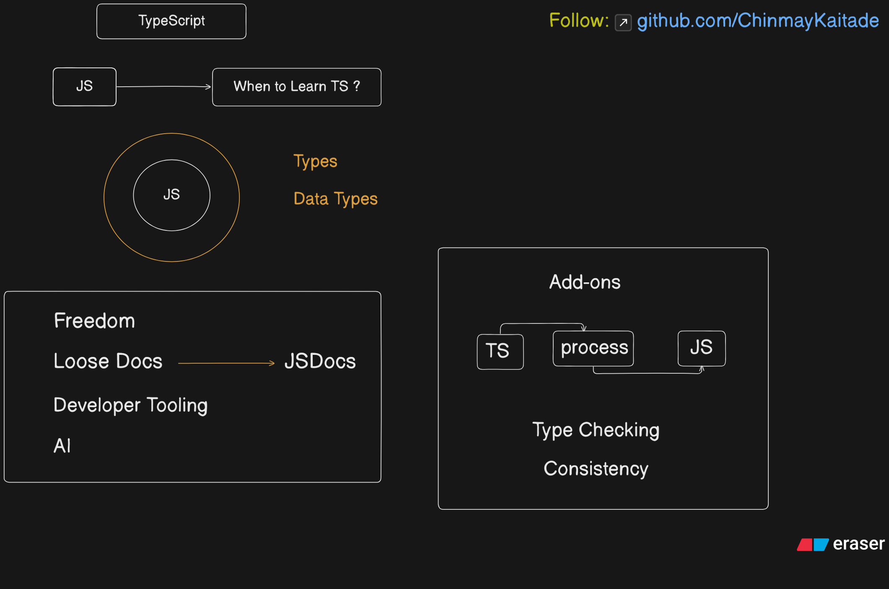

# 01 Introduction to Typescript 🚀❤️

## When to Learn Typescript (TS)?

- After Completing JavaScript (Loops, Functions, etc.)

## 🌟 Introduction to TypeScript: Key Concepts

This diagram outlines the core concepts, benefits, and typical integration points that define TypeScript's relationship with JavaScript.

---

### 🤔 Why Learn TypeScript?

The diagram suggests a natural transition point: if you know **JS (JavaScript)**, the next step is often asking **When to Learn TS (TypeScript)?**

The primary drivers for adopting TypeScript revolve around three main areas:

#### 1. 🛡️ Types & Data Types

- TypeScript is a **superset of JavaScript** that adds **Static Type Checking**.
- It introduces explicit **Types** and **Data Types** to JavaScript, which is dynamically typed. This is the fundamental feature circled in the diagram.

#### 2. 🎯 The "Add-ons" Advantage

This section illustrates the typical workflow and benefits of using TypeScript:

- **TS (TypeScript)** goes through a **process** (the compilation/transpilation step) to become **JS (JavaScript)**.
- **Type Checking:** This process enforces type safety _before_ the code runs, catching errors early.
- **Consistency:** Encourages consistent code structure and use of types across the entire project.

#### 3. 🛠️ Overcoming JS "Freedom"

While JavaScript offers great flexibility ("Freedom"), TypeScript addresses some of its common pain points by enhancing the developer experience:

- **Loose Docs** $\rightarrow$ **JSDocs:** TypeScript leverages JSDocs comments to infer types for plain JavaScript, offering a path to type safety even without full `.ts` files.
- **Developer Tooling:** The presence of types allows for far more powerful and reliable developer tools (like intelligent autocomplete, refactoring, and quick error hints) in IDEs.
- **AI:** Modern tooling and AI-assisted coding heavily rely on the type information provided by TypeScript to offer accurate suggestions.

---

### 📝 Summary of Benefits

TypeScript's main goal is to bring **scale, safety, and robustness** to large-scale JavaScript applications.
